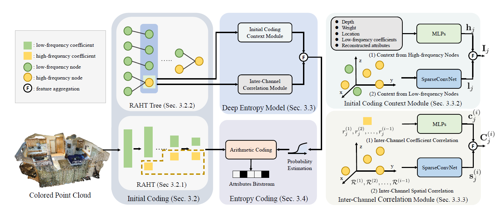

# 3DAC: Learning Attribute Compression for Point Clouds (CVPR 2022)

This is the official implementation of **3DAC**, a learning-based data compression framework for point cloud attributes. For technical details, please refer to:

**3DAC: Learning Attribute Compression for Point Clouds**  <br />
[Guangchi Fang](https://fatpeter.github.io/),[Hanyun Wang](https://scholar.google.com.hk/citations?user=QG3LdUcAAAAJ&hl=zh-CN/),[Yiling XU](https://scholar.google.com/citations?user=638kRwkAAAAJ&hl=en/),[Qingyong Hu](https://www.cs.ox.ac.uk/people/qingyong.hu/),[Yulan Guo](http://yulanguo.me/). <br />
**[[Paper](https://arxiv.org/abs/2203.09931)]** <br />

<p align="center">  </p>


### (1) Setup
This code has been tested with Python 3.7, torch 1.7.0, CUDA 10.2.

- Clone the repository 
```
git clone
```
- Setup python environment
```
conda create -n ThreeDAC python=3.7
conda activate ThreeDAC
pip install -r helper_requirements.txt
```
- Install [torchsparse](https://github.com/mit-han-lab/torchsparse)
```
sudo apt-get install libsparsehash-dev
pip install git+https://github.com/mit-han-lab/torchsparse.git@v1.1.0
```

### (2) ScanNet

1. Download the ScanNet dataset from [the official website](http://kaldir.vc.in.tum.de/scannet_benchmark/documentation) and move it to `./dataset`.
2. Voxelize the point cloud geometry with a 9-depth octree and deduplicate redundant points. We merge this process to the dataloader to simplify our code.
3. Train/eval and compress/decompress scripts are in `./ScanNet`:
```
cd ScanNet
```
4. Train on ScanNet (Qstep denotes the quantization step):
```
python train.py --Qstep=10
```
5. Quick eval:
```
python eval.py --Qstep=10
```
6. Compress scans of ScanNet:
```
python compress.py --Qstep=10
```
7. Decompress:
```
python decompress.py --Qstep=10
```

### (3) SemanticKITTI

1. SemanticKITTI dataset can be found <a href="http://semantic-kitti.org/dataset.html#download">here</a>. Download the files and extract everything into the same folder. Uncompress the folder and move it to `./dataset`.
2. Voxelize the point cloud geometry with a 12-depth octree and deduplicate redundant points. We merge this process to the dataloader to simplify our code.
3. Train/eval and compress/decompress scripts are in `./SemanticKITTI`:
```
cd SemanticKITTI
```
4. Train on SemanticKITTI:
```
python train.py --Qstep=10
```
5. Compress scans of ScanNet (step: compress part of data for quick testing):
```
python compress.py --Qstep=10 --step=200
```
6. Decompress:
```
python decompress.py --Qstep=10--step=200
```


### Citation
If you find our work useful in your research, please consider citing:

    @article{fang20223dac,
      title={3DAC: Learning Attribute Compression for Point Clouds},
      author={Fang, Guangchi and Hu, Qingyong and Wang, Hanyun and Xu, Yiling and Guo, Yulan},
      journal={arXiv preprint arXiv:2203.09931},
      year={2022}
    }


